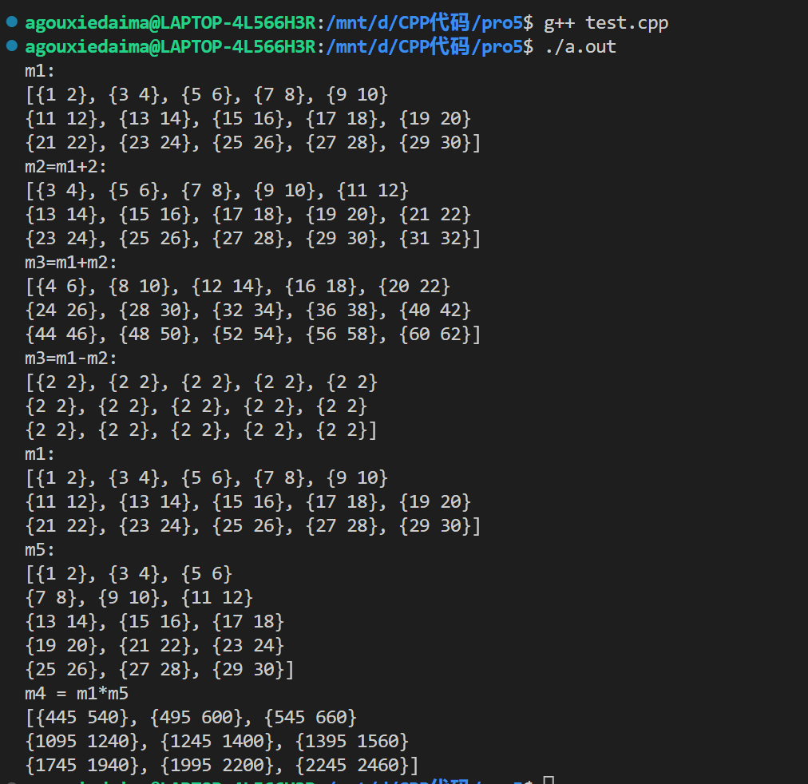
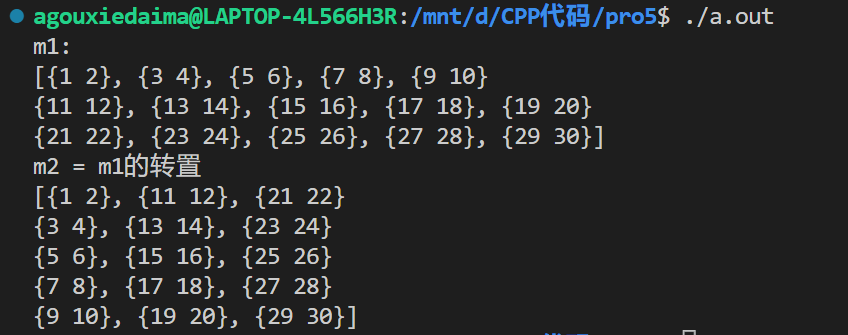
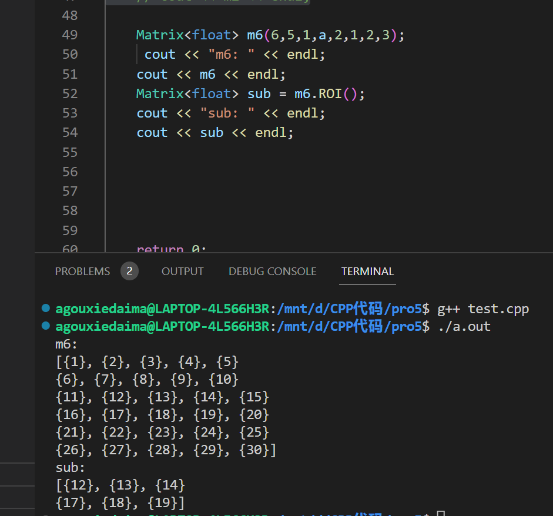

# CS205 C/ C++ Programming - Assignment5
Name: 高祖卿  
SID: 12112710
#Description
本次作业的要求为使用c++设计一个矩阵类，有以下几点要求：
1. 设计一个矩阵类，其中包含矩阵的基本数据信息（行数、列数、channel数...）
2. 矩阵类支持不同的数据类型
3. 避免hard copy，做好内存管理，避免内存泄漏
4. 重载部分运算符以方便使用
5. 初步实现ROI(OpenCV中感兴趣的区域)

本次报告将围绕以上要求展开

#Part1 矩阵模板类的设计
由于我们设计的类要支持多种数据类型，我们这里选用模板类来做实现。模板并不是具体的类和成员函数，而是类似于指导编译器的蓝图，所以模板类的声明和实现都需要放在hpp头文件中。对于模板类，在使用时我们需要显式的提供将要使用的数据类型。例如：
```cpp
Matrix<int> mat;
```
对于矩阵类，我们提供了以下变量
```cpp
class Matrix
{
private:
    size_t row;
    size_t col;
    size_t channel;
    T *data;
    size_t ROIBeginRow;
    size_t ROIBeginCol;
    size_t ROIRow;
    size_t ROICol;
    size_t span;
    size_t *ref_count;
}；
```
该矩阵类中有基础的行数，列数，通道数等信息，并使用一个一维数组的指针来存放矩阵的数据,同时，由于这些变量都是非零的，所以我们均采用size_t这一数据类型。
同时我们定义了ROI区域的起始点ROIBeginRow,ROIBeginCol；行数ROIRow；列数ROICol这四个成员变量来描述一个矩阵中我们感兴趣的区域。
对于内存管理，为了避免大块的内存拷贝(即hard copy)，我们定义一个成员变量 *ref_count来存放使用同一块内存区域的矩阵个数，并在后续对其进行维护，实现soft copy。
同时，矩阵中的元素可能属于不同通道，我们定义并维护一个变量span，其定义为跨行访问元素时需要跨过的元素个数，默认值为 通道数乘列数 ，以提升访问的效率。

#Part2 矩阵模板类函数的设计与实现
   1.默认构造器的实现
   在默认构造器的参数列表，我们给每个成员变量都提供一个合理的值，对所有成员变量进行初始化。
   同时，在进行赋值之前，我们需要对传入的参数进行检查，确保行列数大于零，通道数在1和3之间，ROI区域是子矩阵，不会越界，检查完变量之后，我们给数据数组指针分配内存，因为我们的矩阵类支持多通道矩阵，因此需要使用的内存公式为:
   ```cpp
      size = row*col*channel
      （row:矩阵的行数 col:矩阵的列数 channel:矩阵的通道数）
   ```
如果传入的指针为空，则只进行内存申请操作，若不为空，则申请内存后对传入的数组复制后作为自己的数据数组。
```cpp
    // 根据通道数创建元素数组
    if (data == nullptr)
    {
        this->data = new T[row * col * channel];
    }
    else
    {
        size_t element = row * col * channel;
        this->data = new T[element];
        for (size_t i = 0; i < element; i++)
        {
            this->data[i] = data[i];
        }
    }
```
对于ref_count变量，如果传入的是空指针，那就代表着传入的数据是第一次被使用，我们对ref_count进行初始化，若不为空，则直接令ref_count指针指向传入的指针。
```cpp
    if (ref_count == nullptr)
    {
        this->ref_count = new size_t[1];
        this->ref_count[0] = 1;
    }
    else
    {
        this->ref_count = ref_count;
    }
```
2.复制函数
如果我们不对复制函数进行重载，那么编译器会自动生成该函数，对对象成员变量的值进行复制，所以可能会导致，两个对象的数据数组指针指向同一块内存，那么当一个对象被销毁时，该内存被释放，另一个对象被销毁时，该内存又被释放，从而导致内存的二次释放，使程序崩溃。
那么，我们对复制函数进行重载时，传入的参数是一个矩阵变量的引用，首先，我们需要对传入的参数进行非空检查，如果为空，那么报错并退出。
检查后，我们对其他成员变量进行赋值。
但是对于数据数组的复制，我们不使用hard copy的方法，因为这样的效率很低，我们利用ref_count指针的计数功能来进行soft copy。
也就是说，我们直接将新矩阵的数据数组指针指向原数据数组指针的地址，同时，我们将ref_count指针储存的值加1，在之后实现析构函数时，我们对该指针的值进行检查，来决定是否需要释放数据数组指针指向的内存区域。实现的代码如下：
```cpp
this->ref_count = mat.ref_count;
this->ref_count[0]++;
this->data = mat.data;
```

3.析构函数
析构函数实现的主要功能是对矩阵类对象申请的内存进行释放，避免内存泄漏。
由于我们进行的是soft copy，我们首先要对ref_count指针储存的值进行检查，如果值为1，那么代表着一块内存被唯一的对象使用着，我们需要对这个对象进行销毁并释放这块内存，反之则将ref_count的值减一。
```cpp
Matrix<T>::~Matrix()
{
    if (this->ref_count[0] == 1)
    {
        delete[] this->ref_count;
        this->ref_count = nullptr;
        delete[] this->data;
        this->data = nullptr;
    }
    else
    {
        this->ref_count[0]--;
    }
}
```

4.赋值运算符的重载
对于赋值运算符”=“，如果我们不对其进行重载，那么在进行赋值操作时，会出现与复制函数不重载时相同的问题，由于只传递了地址，所以会导致内存的二次释放，使程序崩溃。
我们采取同样的处理方式，首先，我们对传入的参数进行非空检查，确定其非空后，我们还需要检查传入的参数是否是自己，如果两个对象完全相同，则直接返回原对象。
如果不相同，首先需要判断一下，被赋值的矩阵的数据数组指针被多少个矩阵共用，如果只有自身，那么释放该数据数组指针，若不是，则将ref_count值减一，并将自己的数据数组指针指向赋值矩阵的数据数组指针，同时将自己的ref_count指针指向赋值矩阵的ref_count指针，并加一。
至此，我们完成了赋值运算符的重载的soft copy实现。
```cpp
Matrix<T> &Matrix<T>::operator=(const Matrix<T> &mat)
{
    // 防止自赋值
    if (this == &mat)
    {
        return *this;
    }
    // 如果不是自赋值，则释放原有对象成员指针指向的内存并将非指针变量一一赋值
    if (this->ref_count[0] == 1)
    {
        delete[] this->data;
        this->data = nullptr;
        delete[] this->ref_count;
        this->ref_count = nullptr;
    }
    else
    {
        this->ref_count[0]--;
    }

    this->row = mat.row;
    this->col = mat.col;
    this->channel = mat.channel;
    this->ROIBeginRow = mat.ROIBeginRow;
    this->ROIBeginCol = mat.ROIBeginCol;
    this->ROIRow = mat.ROIRow;
    this->ROICol = mat.ROICol;
    this->span = mat.span;
    this->ref_count = mat.ref_count;
    this->ref_count[0]++;
    this->data = mat.data;
    return *this;
}
```

6.运算符的重载
   1)"()"运算符的重载
   为了方便访问矩阵中的元素，我们对"()"运算符进行了重载，通过传入需要访问第几行第几列哪一个通道的数，直接访问到该坐标的元素。
```cpp
   T &Matrix<T>::operator()(size_t row, size_t col, size_t ch)
{
    // 参数合法性检查
    if (row < 0 || col < 0)
    {
        std::cerr << "The input of row and column should not be less than 0." << std::endl;
        exit(EXIT_FAILURE);
    }
    if (ch < 1 || ch > channel)
    {
        std::cerr << "The input of channel should between 1 and 3" << std::endl;
        exit(EXIT_FAILURE);
    }

    return data[row * this->span + col * this->channel + ch - 1];
}
```
   2)"<<"运算符的重载
   为了便于打印矩阵，用cout就能将矩阵输出，我们重载了"<<"运算符。代码如下：
   ```cpp
 std::ostream &operator<<(std::ostream &os, Matrix<T> &mat)
{
    size_t ch = mat.channel;
    size_t r = mat.row;
    size_t c = mat.col;
    os << "[";
    for (size_t i = 0; i < r; i++)
    {
        for (size_t j = 0; j < c; j++)
        {
            os << "{";
            for (size_t k = 1; k <= ch; k++)
            {
                os << mat(i, j, k);
                if (k != ch)
                    os << " ";
            }
            os << "}";
            if (j != c - 1)
                os << ", ";
        }
        if (i != r - 1)
            os << "\n";
    }
    os << "]";
    return os;
}
  ```
  3)"+""-"的重载
  对于"+"和"-"的重载，以加法为例，我们实现了矩阵+常数、常数+矩阵以及矩阵+矩阵。
  首先，我们对传入的参数进行非空检查（仅对矩阵+矩阵），之后再确定矩阵的大小是否相同，否则报错并退出程序，之后在方法中对对应的数据逐一相加，返回一个新的矩阵。
  ```cpp
Matrix<T> Matrix<T>::operator+(const Matrix<T> &addend) const
{

    // 参数合法性检查
    if (row != addend.row || col != addend.col || channel != addend.channel)
    {
        std::cerr << "In '+' operator overloading..." << std::endl;
        std::cerr << "The size of the two matrix should be the same." << std::endl;
        exit(EXIT_FAILURE);
    }

    Matrix<T> mat;
    mat.row = this->row;
    mat.col = this->col;
    mat.ROIBeginRow = this->ROIBeginRow;
    mat.ROIBeginCol = this->ROIBeginCol;
    mat.ROIRow = this->ROIRow;
    mat.ROICol = this->ROICol;
    mat.channel = this->channel;
    mat.span = this->span;

    size_t element = this->row * this->col * this->channel;
    mat.data = new T[element];

    for (size_t i = 0; i < element; i++)
    {
        mat.data[i] = this->data[i] + addend.data[i];
    }

    return mat;
}
  ```

  4)"*"的重载
  对于矩阵乘法的实现，首先我们需要检查传入的参数是否为空，之后需要检查两个矩阵的大小是否符合相乘的规则，由于本次实现的是多通道矩阵的乘法，所以还要检查通道数是否相同。
  有了上一个项目的经验，所以我们选用访存优化和openMP对矩阵乘法进行速度的提升。对于多通道矩阵乘法，我们可以依次对不同通道的元素进行计算。我们使用kij的顺序来进行访存优化，同时在循环外加上openMP的优化。矩阵相乘计算部分的代码如下：
  ```cpp
  #pragma omp parallel for schedule(dynamic)
    for (size_t k = 0; k < multiplier.row; k++)
    {
        for (size_t i = 0; i < this->row; i++)
        {
            for (size_t j = 0; j < multiplier.col; j++)
            {
                for (size_t ch = 1; ch <= this->channel; ch++)
                {
                    product(i, j, ch) += (*this)(i, k, ch) * multiplier(k, j, ch);
                }
            }
        }
    }
  ```

  5)矩阵转置的实现
  我们通过重载"!"来实现矩阵的转置，核心代码如下：
  ```cpp
for (size_t i = 0; i < mat.row; i++)
    {
        for (size_t j = 0; j < mat.col; j++)
        {
            for (size_t k = 1; k <= mat.channel; k++)
            {
                mat(i, j, k) = this->data[j * this->span + i * this->channel + k - 1];
            }
        }
    }
  ```

#Part3 ROI的初步实现
在openCV中 ROI代表的是对一幅图像感兴趣的区域，在矩阵中，我们可以把ROI看成是一个矩阵的子矩阵，我们通过维护相关变量，可以在需要使用时将ROI区域提取出来作为一个新的矩阵。
我们已经在矩阵类中储存了子矩阵的起始位置和行数和列数，因此，我们可以通过直接信息将子矩阵提取出来，但是，为了避免大段的内存拷贝，我们这里使用soft copy的方式来实现：
首先，我们需要新建一个数组，然后，对于母矩阵，我们有数据数组指针的地址，也就是数据的起始地址，我们通过子矩阵的起始位置信息，可以得到子矩阵数据的起始地址，我们将子矩阵的数据数组指针的地址指向子矩阵数据的起始地址，同时将子矩阵的ref_count置为母矩阵的ref_count并加一，便实现了子矩阵的提取，同时避免了大量的内存拷贝。
```cpp
Matrix<T> Matrix<T>::ROI() const
{
    // 对ROI的边界的合法性进行检查
    if (ROIBeginRow + ROIRow > row || ROIBeginCol + ROICol > col)
    {
        std::cerr << "The region of interest should not exceed the region of the matrix." << std::endl;
        exit(EXIT_FAILURE);
    }
    Matrix mat;

    mat.row = this->ROIRow;
    mat.col = this->ROICol;
    mat.channel = this->channel;
    mat.data = this->data + ROIBeginRow * col * channel + ROIBeginCol * channel;
    mat.ref_count = this->ref_count;
    mat.ref_count[0]++;
    mat.span = this->col * this->channel;
    return mat;
}
```
同时，我们还实现了一些set方法来重新设定一个矩阵中的ROI。

#Part4 code
请见github：https://github.com/Agouiscoding/cpppro5

#Part5 Result and Verification
基本运算符的验证
加减乘

转置


ROI验证

